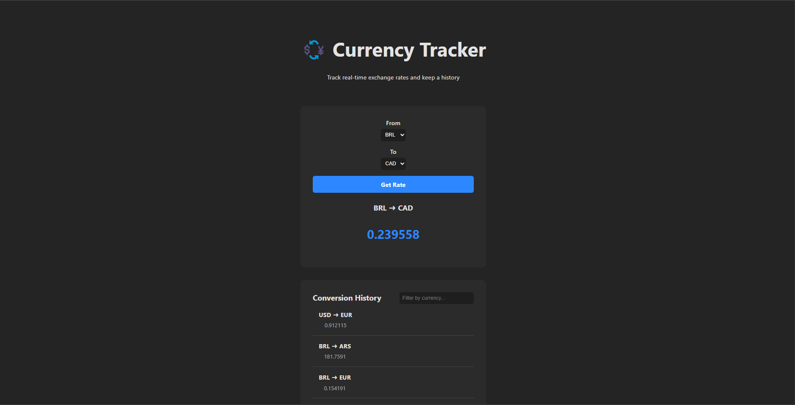

# 💱 Currency Tracker

A fullstack application to monitor real-time exchange rates and keep a history of currency conversions.

## ⚠️ Attention!

- I'm **not a Vue expert** (yet 👀) — but I had a great time working with the technology! I hope I did okay, and I'm genuinely excited to dive deeper into it. 😄

- This project doesn't reflect **100% of my skills** or **100% of my seniority** — I kept things **as pragmatic and sensible as possible** to fulfill what was required. And honestly, being pragmatic is a pretty awesome skill too, right? 😉

So, if you spot something that could be improved... I probably noticed it too, I just chose my battles. 😂


## 🔧 Requirements

- Docker  
- Docker Compose  

## 🧱 Architecture

This project is composed of:

- **Frontend (UI)**: Vue.js app served by NGINX  
- **Backend (API)**: ASP.NET Core Web API  
- **Worker**: Background service for processing exchange data  
- **Database**: SQL Server 2022  

## 🚀 Running the Application

Follow the steps below to run the project locally using Docker only:

### 1. Clone the repository

```bash
git clone https://github.com/your-user/currency-tracker.git
cd currency-tracker
```

### 2. Build and start the containers

```bash
docker compose up
```

> On the first run, it may take a few minutes to install Node.js and .NET dependencies.

## 🌐 Accessing the Application

- **Frontend (UI)**: http://localhost:3000  
- **Backend (API)**: http://localhost:5000  
- **SQL Server**: localhost:1433  
  - User: `sa`  
  - Password: `YourStrong!Passw0rd`  

## 📦 Folder Structure

```
.
├── docker-compose.yml
├── WebApi/                # ASP.NET Core Web API
├── src/Worker/            # Background Worker Service
└── currency-tracker-ui/   # Vue.js Frontend App
```

## 📝 Notes

- Database connection strings are automatically configured via environment variables.
- Internally, services communicate using `http://currency_api:8080` for API access.

## ✅ Quick Test Checklist

- [x] Open http://localhost:3000 and see the currency conversion UI.  
- [x] Convert between currencies and view the conversion history.  
- [x] Use the search box to filter historical records.  
- [x] Data is saved to the SQL Server container.  

## 🛠 Technologies Used

- Vue 3 + Vite  
- ASP.NET Core 8  
- SQL Server 2022  
- Docker + Docker Compose  
